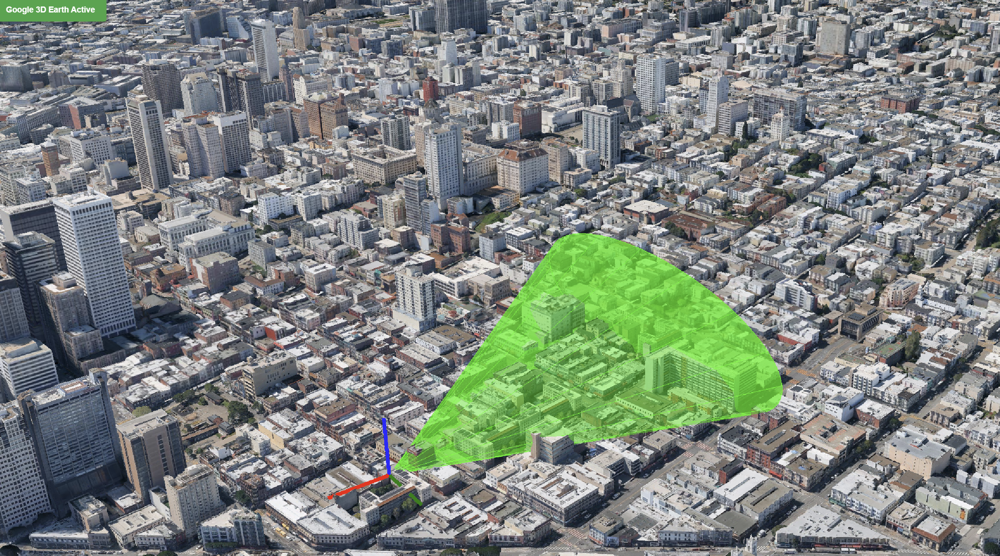

Tung Le 
A few weeks ago, I watched a traveler struggle at a crowded train station simply because they relied entirely on translation apps rather than reading surrounding environmental cues.

Context clues are the invisible cheat codes of international travel. From color-coded transit lines to observing local queueing etiquette, learning to read subtle environmental patterns empowers you to navigate unfamiliar cities with total ease.

When words fail, intuition and spatial observation bridge the gap between confusion and seamless navigation.

### Four practical context clues to observe abroad:

- **Color Coding** — Green universally signals exits or safety; blue indicates official transit or info desks.
- **Body Language** — Watch how locals interact at counters before stepping up to order.
- **Iconography** — Standardized pictogram icons for tickets, platforms, and baggage are universal.
- **Spatial Flow** — Fast-moving queues indicate quick automated counters; longer lines often mean custom service.
